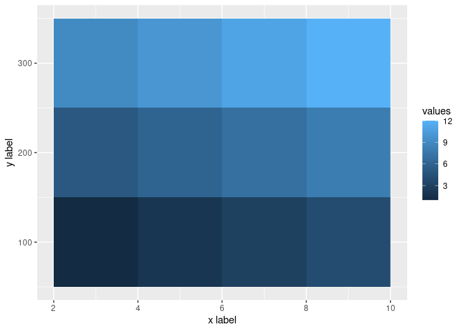

<!-- README.md is generated from README.Rmd. Please edit that file -->

# ggmatrix

<!-- badges: start -->
<!-- badges: end -->

Provide a geom able to rasterize matrices faster than `geom_raster()`.

## Installation

You can install the development version of ggmatrix from
[GitHub](https://github.com/) with:

``` r
# install.packages("devtools")
devtools::install_github("zeehio/ggmatrix")
```

## Example

This is a basic example which shows you how to solve a common problem:

``` r
library(ggmatrix)
#> Loading required package: ggplot2

x_small <- c(3,5,7,9)
y_small <- c(100,200,300)
mat_small <- matrix(
  seq(from = 1, to = length(x_small)*length(y_small)),
  nrow = length(x_small),
  ncol = length(y_small)
)
dimnames(mat_small) <- list(x = x_small, y = y_small)


ggplot() + geom_matrix_raster(matrix = mat_small)
```


